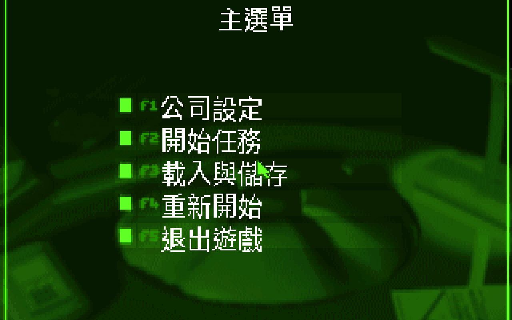
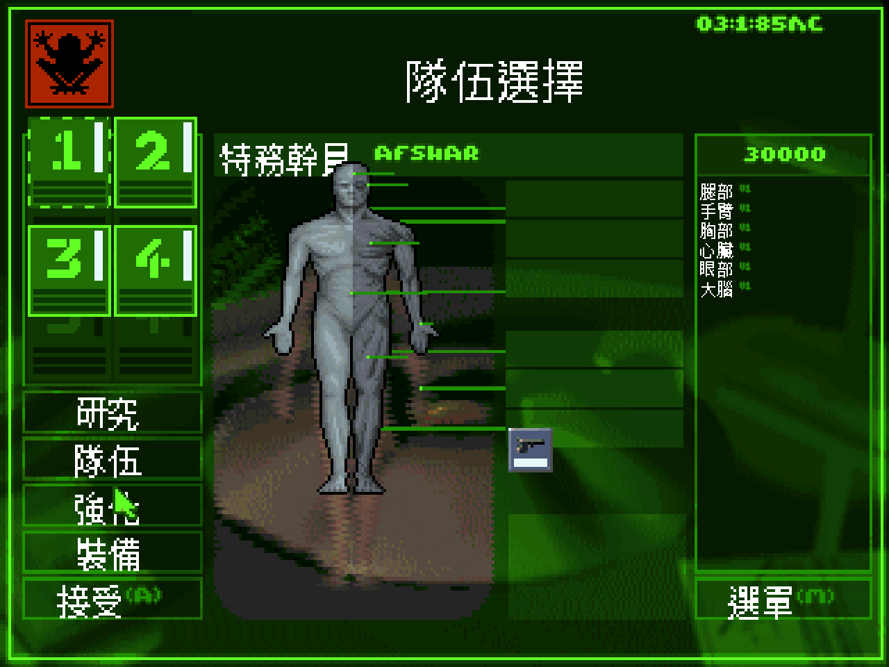
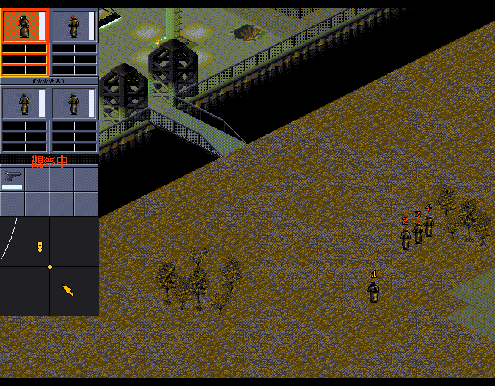
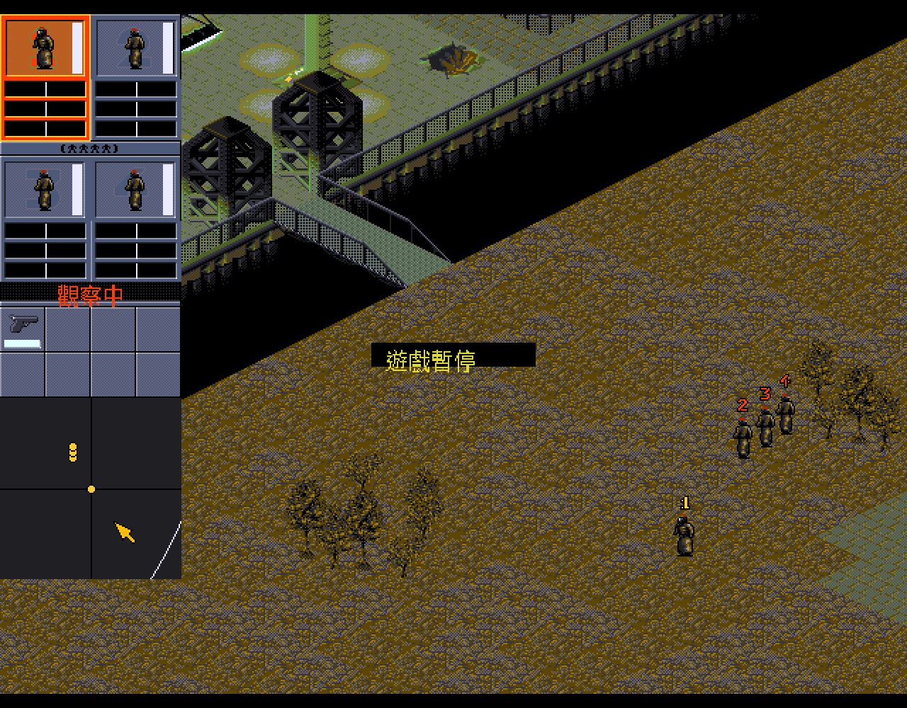

# 極道梟雄 — Syndicate (1993) 繁體中文化

> *Syndicate*（Bullfrog／EA, 1993）的繁體中文化紀錄 ✦ 建構於開源引擎 **FreeSynd**
> 全 373 條 UI 字串 + 50 關任務簡報全翻譯 ✦ Noto Sans CJK TC 點陣字 ✦ 系統 IME 中文輸入

這個 repo 是一份 **「翻譯紀錄 / 補丁」**，不是遊戲本體。它只收錄**我的翻譯成果**——
**原版英文文字（EA 版權）一個字都沒有**，只用雜湊值（FNV-1a 64-bit）對應。
你用自己的正版 *Synd_1993* 資料，在本機算回雜湊套用即可。

---

## 📸 實機截圖

| 主選單 | 隊伍選擇 |
|---|---|
|  |  |

| 戰場（即時 HUD：觀察中／移動中） | 遊戲暫停 |
|---|---|
|  |  |

---

## 🌃 關於《極道梟雄》— 一個沒有政府、只有財團的未來

《Syndicate》是 **Bullfrog Productions**（《上帝也瘋狂 Populous》、《主題公園 Theme Park》、《地下城守護者 Dungeon Keeper》的傳奇工作室）於 **1993 年**推出的即時戰術經典，Electronic Arts 發行，主設計 Sean Cooper。

### 世界觀
二十一世紀，各國政府早已崩潰，世界被少數巨型**財團（Syndicate）**瓜分統治。財團透過植入市民腦中的晶片操控他們對現實的感知——人們眼中那個「美好世界」，其實是財團餵給他們的幻覺。你，是其中一個財團的新任掌權者；目標只有一個：**讓其他財團從地球上消失，獨霸全球。**

> 「在被黑道組織主宰的未來世界中，只有武力才是唯一的真理。身為某一黑道組織的頭兒，你當然要想辦法把其他的人從你的地盤趕出去……」
> ——《軟體世界》第 61 期（1994）

### 你怎麼玩
- **指揮四名改造幹員**：在等距視角的雨夜霓虹都市裡潛行、暗殺、掃蕩。每名幹員的眼、腦、心臟、四肢都能換上研發出來的生化零件升級，再以 **IPA**（智力／感知／腎上腺素）三條滑桿微調反應速度與耐受度。
- **勸服器（Persuadertron）**：本作的招牌裝置——不必開槍，用它「說服」平民乃至敵方幹員加入你，讓對手的部隊在你面前倒戈成你的人海。
- **征服世界地圖**：未來地球切成約 **50 塊領地**（西歐、遠東、北美……），你一關關拿下、課稅、把收入投入研發更強的武器（迷你機槍、雷射槍、高斯槍、火焰噴射器……）與改造，將勢力範圍一塊塊染成自己的顏色。
- **任務百態**：暗殺目標、全滅敵方、說服特定人物、竊取裝備、護送……每關開打前都有一段 **任務簡報**——也正是本中文化最費心的部分。

### 為何難忘
陰鬱的賽博龐克氛圍、環境電子配樂、霓虹與血色交織的等距城市，讓《極道梟雄》在 1990 年代的策略遊戲裡獨樹一格；它把「企業即政府、人民即耗材」的反烏托邦寓言，包進一場場冷血的城市作戰。1996 年推出續作《Syndicate Wars》，2012 年 EA 重啟為第一人稱射擊；而開源引擎 **FreeSynd** 讓這部 1993 年的原作至今仍能在現代系統上運行——本中文化便建構於它之上。

> **譯名小考**：**極道**（黑道、江湖）＋ **梟雄**（狠辣而有野心的梟首）——「極道梟雄」四字，正是這位在霓虹廢墟裡爭奪天下的財團頭子最貼切的寫照。這個台灣譯名見於 1994 年《軟體世界》第 61 期（詳見下方史料章節）。

---

## ⚙️ 武器、裝備與幹員改造

### 🔫 武器與裝備一覽
（中文名取自本中文化 `chinese-tw.lng`；特性參酌遊戲機制與《軟體世界》第 61 期）

| 武器／裝備 | 類型 | 特性 |
|---|---|---|
| 手槍 Pistol | 起手 | 初始配備，威力弱，但射程比散彈槍遠 |
| 散彈槍 Shotgun | 近戰 | 近距離威力驚人，射程遠遜手槍；敵方守衛常見配備 |
| 烏茲衝鋒槍 Uzi | 連發 | 中距離快速掃射 |
| **迷你機槍 Minigun** | 連發 | **最划算的主力**：價格合理、火力足，壓制敵人的首選 |
| 火焰噴射器 Flamer | 近戰範圍 | 近距離噴火，範圍殺傷 |
| 長距離槍 Long Range | 狙擊 | 射程最遠，但每次「來一發」、難造成重傷，適合遠距精準暗殺 |
| 雷射槍 Laser | 高階直射 | 射程遠、可摧毀裝甲運兵車、穿牆殺人；價格稍高 |
| **高斯槍 Gauss Gun** | 重型爆裂 | **威力之最**，可見敵人全身起火燃燒；但彈藥僅約 5 發、奇貴 |
| 定時炸彈 Time Bomb | 投擲爆裂 | 爆炸範圍大、威力不小，但難算時機；撿敵人掉落的可賣好價 |
| 能量護盾 Energy Shield | 防禦 | 吸收傷害的護身裝備 |
| **勸服器 Persuadertron** | 特殊 | 不殺傷，而是「說服」目標倒戈、加入你的部隊 |
| 醫療包 Medikit | 輔助 | 為幹員回復生命 |
| 掃描器 Scanner | 輔助 | 掃描周遭、揭示區域 |
| 門禁卡 Access Card | 輔助 | 開啟管制門禁 |

> 小訣竅：雷射、高斯槍等**燃燒性武器**會把敵人燒成灰燼，事後撿不到他們身上的武器；
> 想「借敵壯己」回收裝備，迷你機槍才是最適當的選擇。（《軟體世界》第 61 期）

### 🦾 幹員改造系統
你的幹員不是血肉之軀，而是可不斷強化的**改造人（cyborg）**：

- **生化義體**：眼、腦、心臟、胸、手臂、雙腿各部位，都能換上研發出來的義體（版本 v1 → v3 逐級提升），改善耐久、移動速度、視野等。在 **研究** 畫面研發、在 **隊伍選擇** 畫面為每名幹員裝配。
- **IPA 三維**：每名幹員有 **智力 Intelligence／感知 Perception／腎上腺素 Adrenaline** 三條滑桿。拉高可讓幹員自主判斷更準、警覺範圍更廣、行動與開火更猛，但會消耗其 IPA 儲備，需研發提高上限。
- **戰術**：出擊前在「隊伍選擇」決定每名幹員的義體與 IPA 配置。面對裝備精良、已強化的敵方財團幹員，先升級你的義體與腎上腺素，往往就是勝負的關鍵。

---

## 🤖 AI 模式：正常 vs 聰明 — 1993 的規則，2026 怎麼讓它更聰明

1993 年的 Syndicate，敵人 AI 受限於當年機能，常常**直線暴衝、原地把彈匣打空**；你的幹員若沒先拔槍，就只能站著挨子彈。我們**沒有把這些行為改掉**——而是做成一個**可切換的選項**：到「**公司設定**」就能在 **AI：正常**（忠於 1993 原版）與 **AI：聰明**（2026 強化）之間切換。純粹派玩正常，想要更兇的對手玩聰明。

差異最有感的，是**敵我面對面**的那一刻：

### 我方幹員 — 被敵人盯上時

```
【正常 Classic】忠實重現原版
   敵 ▶▶▶▶▶ 開火 ───►  我 ✗  沒先拔槍 → 站著挨打
   敵 ▶▶▶▶▶ 開火 ───►  我 ▼  已持槍   → 原地還擊（不會自己走位）

【聰明 Smart】幹員會自衛
   敵 ▶▶▶▶▶ 開火 ───►  我 ⟳  自動拔出「傷害最高」的武器 → 還擊
                            ⚡  腎上腺素高 → 反應/掃描更快
                            🎯  智力高     → 散布收窄、打得更準
```

### 敵方 — 追擊與守備

```
【正常】                          【聰明】
 我 ←─逃                           我 ←─逃
 敵 ▶▶▶▶▶▶▶▶▶▶▶ 無限追擊            敵 ▶▶▶ ⟳ 失去視線滿 4 秒 → 放棄、回防
 （追到天涯海角、不會放棄）         守衛 ▣ 守在崗位，有人進範圍才開火
                                   （不再全員一起暴衝）
```

> **感知（Perception）** 決定多遠能發現你、**腎上腺素（Adrenaline）** 決定反應多快、**智力（Intelligence）** 決定打得多準——聰明模式才會真正吃這三條 IPA。所以同一隊幹員，IPA 配置不同，自衛表現天差地別。技術細節見 [Syndicate AI 邏輯考古](docs/syndicate-ai-logic.md)。

> 這些 AI 行為是上游 FreeSynd README 標為 *IN PROGRESS* 的兩個項目（敵方追擊、我方依 IPA 自衛），我們把缺口補完、做成可切換並驗證無 crash，見 [`patches/04-ai-improvements.patch`](patches/README.md)。

---

## 🗺️ 各國領地 — 50 塊未來地球版圖

世界地圖把未來地球切成 **50 塊領地**。你從 **西歐**（開場城市「新海森 New Hessen」）起家，一關一塊向外征服；每拿下一塊，就能對其人口**課稅**充實軍費。但稅率拉太高，民心會從滿意一路滑到**反叛**——屆時得再派幹員鎮壓。

**民心階梯**（地圖面板的「狀態」欄）：
　非常滿意 → 滿意 → 普通 → 不滿 → 不悅 → **反叛**

**領地一覽**（中文名取自本中文化 `chinese-tw.lng`）：

| 區域 | 領地 |
|---|---|
| 🇪🇺 歐洲 | 西歐、東歐、中歐、斯堪地那維亞 |
| 🌏 亞洲 | 遠東、中國、蒙古、伊朗、伊拉克、阿拉伯、印度、哈薩克、烏拉爾、西伯利亞、堪察加、印尼 |
| 🦅 北美 | 加州、科羅拉多、洛磯山、中西部、美國南部、新英格蘭、墨西哥、阿拉斯加、育空、格陵蘭、紐芬蘭、東北領地、北方領地、西北領地 |
| 🌎 南美 | 秘魯、巴西、阿根廷、烏拉圭、巴拉圭、委內瑞拉、哥倫比亞 |
| 🌍 非洲 | 南非、肯亞、蘇丹、薩伊、奈及利亞、利比亞、阿爾及利亞、茅利塔尼亞、莫三比克 |
| 🦘 大洋洲 | 西澳、新南威爾斯 |
| 🌊 海上 | **大西洋加速器**（架在大西洋上的未來巨構）、環太平洋 |

> 起手在西歐、終局指向 **中國**——一塊塊把世界地圖染成你財團的顏色，就是稱霸全球的路。

---

## ⚡ 快速開始

### 你需要準備
1. **你自己的正版 Syndicate (1993)** — `Synd_1993.zip` 解壓出的 `MISS01.DAT`…`MISS50.DAT` 等原始檔。
2. **支援 `CHINESE_TC` 的 FreeSynd 建置** — 含繁中引擎修改（字型 CJK 分流、UTF-8 簡報 loader、IME）。
   引擎修改以 GPL patch 形式收錄於 [`patches/`](patches/)（核心繁中化 + 兩個畫面版本：640×480 銳利 / 1024×768 平滑），套用方式見 [`patches/README.md`](patches/README.md)。

### 三步套用
```bash
# 1. 取得本 repo
git clone https://github.com/wicanr2/freesynd-cht.git && cd freesynd-cht

# 2. 編譯 unrnc(解原版 RNC 壓縮),把你的原版資料放到 ./synd-data/
g++ -std=c++17 -I <freesynd>/utils/include tools/unrnc.cpp \
    <freesynd>/utils/src/dernc.cpp -o tools/unrnc

# 3. 用你自己的原版套用翻譯 → 產生可玩的 data/lang/chinese-tw/missNN.txt
python3 tools/apply_public.py ./synd-data
```
接著把 `data/lang/chinese-tw.lng`、`data/lang/chinese-tw/`、`fonts/*.fnt` 放進 FreeSynd
的 data 目錄，`user.conf` 設 `language = 5` 即可。

---

## 🔒 IP 乾淨設計 — 為什麼只有雜湊

EA 仍持有 Syndicate 的版權。**散布原版英文文字（任務簡報敘事）是不允許的。**
所以本 repo 採與 [u6-cht](https://github.com/wicanr2/u6-cht) 相同的做法：

```jsonc
// translations_public/miss01.json
{ "translations": [
  { "hash": "5b9247244dbec93f",      // = fnv1a64(原版英文段落) — 原文「不」存
    "zh":   "傭兵營區。\n\n暗殺。\n…", // 只存我的中譯
    "note": "default briefing" }
]}
```

- **原版英文**：只以 `fnv1a64()` 雜湊存在，無法還原成原文 → 不構成散布。
- **中譯**：是我的創作成果，公開分享。
- `tools/apply_public.py` 讀**你**的 `MISS*.DAT`，算每段英文的雜湊，對回中譯，
  在你本機組出可玩的簡報檔。原文永遠只存在你的正版裡。
- 成本數字、簡報結構等也都來自你的原版（apply 時逐字複製）。

> 短功能 UI 字串（選單、武器名、國名…）收錄於 `data/lang/chinese-tw.lng`，
> 與 FreeSynd 既有的法／德／義 `.lng` 同等性質（社群公認的在地化合理使用）。

---

## 🔧 技術筆記

- **字型**：`fonts/chinese-16.fnt`（大標題／按鈕）與 `chinese-12.fnt`（內文／清單），
  皆由 **Noto Sans CJK TC**（OFL）以 `tools/ttf2fnt.py` 點陣化，1bpp、依格子尺寸填滿。
  16×16 在 4:3 畫布下方正不變形。字集白名單見 `tools/charset.txt`（`build_charset.py` 生成）。
- **簡報格式**：六段以 `|` 分隔——段 0/1 為情報／強化成本（整數，含原版 sentinel 如 `200O`），
  段 2–5 為預設簡報＋三個情報等級的散文。引擎以 `loadBriefingUtf8` 讀取（跳過 `#` 註解、
  單一 `\n` 折成空格、空行為段落）。
- **斷行**：中文無空白,工具與譯文以全形字寬對齊簡報欄寬。

---

## 📰 1994 台灣遊戲媒體裡的「極道梟雄」

本中文化沿用的台灣譯名「**極道梟雄**」，可追溯到 1990 年代的台灣遊戲媒體。
《**軟體世界**》月刊第 61 期（**1994 年 4 月號**）在〈GAME 林秘笈〉專欄，以
**〈極道梟雄新手上機篇〉**（廖奇建，pp.70–71）介紹本作，開頭這樣勾勒這個賽博龐克世界：

> 「在被黑道組織主宰的未來世界中，只有武力才是唯一的真理。身為某一黑道組織的頭兒，
> 你當然要想辦法把其他的人從你的地盤趕出去……所以暗殺、破壞、掃蕩就是家常便飯了。」

文中歸納的五項上手要訣，三十年後仍是 Syndicate 的精髓：

| | 要訣 | 重點（1994 軟體世界） |
|---|---|---|
| ① | 要有花錢的哲學 | 經費有限，生財器具（感化器／Persuadertron）優先於武器研究 |
| ② | 認清任務的內容 | **務必看任務簡報的最後一段**，主目標以 `< >` 標出 — 本中文化簡報正照此格式呈現 |
| ③ | 了解武器的性能 | 迷你機槍最划算、雷射槍射程遠、高斯槍威力最大但彈藥稀少昂貴 |
| ④ | 善用地形效果 | 佔據高樓制高點俯射，「就像〈誰殺了甘迺迪〉裡躲在高樓的狙擊手」 |
| ⑤ | 借助敵人，壯大自己 | 撿敵人掉落的武器，尤以定時炸彈最值錢 |

> 當年雜誌把 Persuadertron 譯為「感化器」，把暗殺潛入的氛圍寫得活靈活現。
> 三十年後，這份在地化讓新玩家能用母語，重走廖奇建筆下那條「稱霸世界」的漫漫長路。
>
> 史料出處：《軟體世界》月刊第 61 期（中華民國 83 年〔1994〕4 月），軟體世界雜誌社，pp.70–71。
> 本 repo 僅作引用與評述，未轉載原文掃描頁。

---

## 🙏 致謝與授權

- **遊戲引擎**：[FreeSynd](https://github.com/bni/freesynd)（GPLv3）——Syndicate 的開源重製。本中文化的引擎側修改基於它。
- **字型**：[Noto Sans CJK](https://github.com/notofonts/noto-cjk)（SIL Open Font License 1.1）。
- **原版遊戲**：*Syndicate* © 1993 Bullfrog Productions / Electronic Arts。**本 repo 不含、也不散布任何 EA 原始素材**；請使用你自己的正版。
- **翻譯／工具**：© 本專案作者，個人非商業性質的中文化成果。
- 同系列紀錄：[u6-cht](https://github.com/wicanr2/u6-cht)（創世紀VI 繁中化）。
